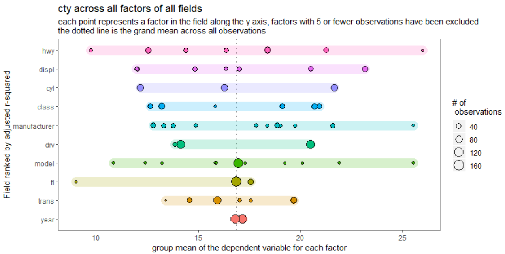
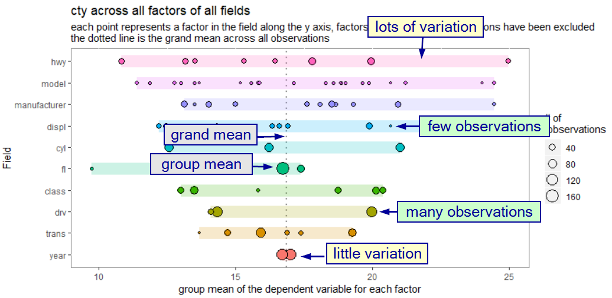
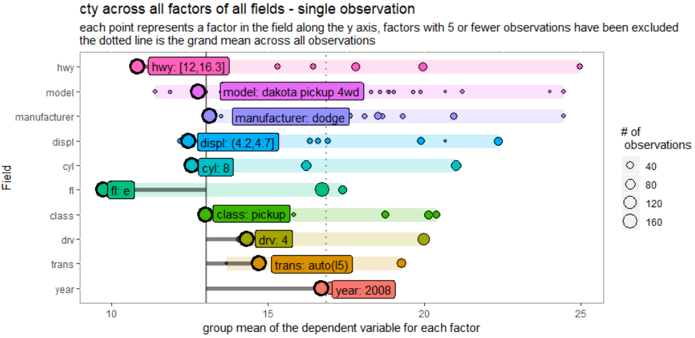

<!-- README.md is generated from README.Rmd. Please edit that file -->

# whereiation

<!-- badges: start -->

<!-- badges: end -->

`where` *(is the var-)* `iation` ?

The goal of `whereiation` is to run a pre-analysis screen of your data.
Before guessing which fields you should look at, these charts are
designed to help you understand variation for an oucome variable across
all fields in your data.

## Installation

You can install the development version from
[GitHub](https://github.com/) with:

``` r
# install.packages("devtools")
devtools::install_github("rjake/whereiation")
```

## Example

There is a plotting function which is used to visualize the variation in
the dependent variable across all factors in all fields.

``` r
library(whereiation)
## basic example code
plot_spread(ggplot2::mpg, "cty")
```



The variation plot is likely to be unfamiliar. This image should help
explain what’s going on (click to see a bigger pic):



The idea is that categories matter. I like to think of it as a
tug-of-war between different identities a single observation holds in
comparison with the grand mean (dotted line below). In this example,
being a Toyota (`manufacturer == "toyota"`) linked it to having a higher
city mpg than the grand mean (19 mpg vs 17 mpg). Because the factors in
`manufacturer` have more variation, this field pulls more strongly on
the estimated mpg than the `year`. In this case, there is very little
difference between cars from 1998 and 2008. Although this observation
has `year == 2008` and observations with this year are lower than in
1998, the low variation leads to less pull on the estimate.

for has a group mean well below the grand mean (across all
manufacturers/observations). The 8 cyl (V8) engine has a similar
contribution. As you work your way from highest to lowest, the
expectation is that the impact of these different factors have less and
less pull.

Sometimes it’s easier to see an example of where one observation may
fall. For this you can use

``` r
plot_spread_single_obs(
  df = ggplot2::mpg, 
  dv = "cty", 
  id = 182, # essentially the row number
  labels = TRUE
)
```


